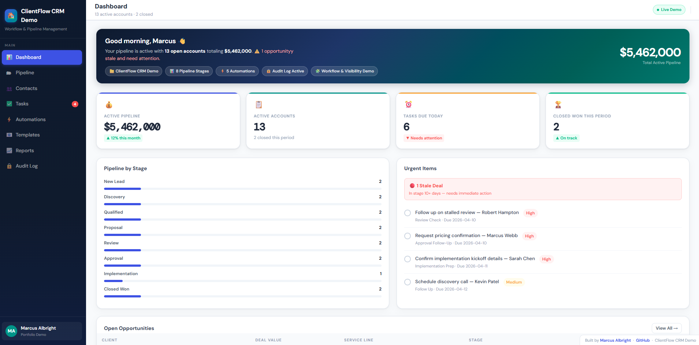

# 🚀 ClientFlow CRM – Workflow & Pipeline Management System

## 🔗 Live Demo
https://techbymarcus.github.io/ClientFlow-CRM-Demo/

---

## 📌 Overview

ClientFlow is a workflow-driven CRM system designed to simulate how organizations manage client pipelines, track activity, and maintain operational visibility in high-volume environments.

The focus of this project is on **process structure, accountability, and workflow efficiency**, not just data storage.

---

## 🎯 Business Problem

In many operations environments:

- Accounts get stuck in the pipeline  
- Follow-ups are inconsistent  
- Teams lack visibility into workflow status  
- Bottlenecks go unnoticed  
- Manual processes slow down performance  

ClientFlow addresses these issues by introducing structured workflow stages, task tracking, and system-level visibility.

---

## ⚙️ Key Features

- Pipeline stage tracking (Lead → Close)  
- Task management and follow-up tracking  
- Workflow automation concepts  
- Audit logging for activity tracking  
- Reporting and operational visibility  
- Contact and account management  

---

## 🧠 Operational Value

This project demonstrates:

- Workflow design and process optimization  
- Visibility into pipeline performance  
- Reduction of operational inefficiencies  
- Structured approach to high-volume account management  
- System-based thinking for operations improvement  

---

## 🛠️ Tech Stack

- HTML  
- CSS  
- JavaScript  
- GitHub Pages (deployment)  

---

## 📌 Real-World Application

ClientFlow reflects systems used in:

- Call center operations  
- CRM pipeline management  
- Customer onboarding workflows  
- Business funding and lending environments  

---

## 🎯 What This Project Demonstrates

- Ability to design structured workflow systems  
- Understanding of operational bottlenecks and solutions  
- Application of automation concepts to real-world processes  
- Strong alignment with operations and systems-based roles  

---

## 👤 Author

Marcus Albright  
https://github.com/techByMarcus

